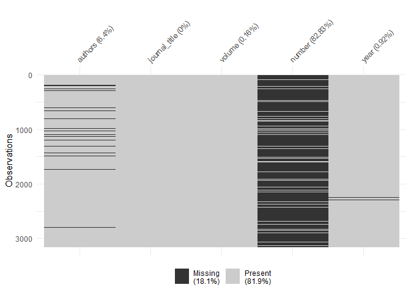
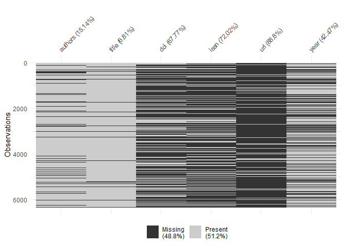

Quantify extraction success
================

``` r
library(tidyverse)

df <- read_csv("processed_data/extracted_references.csv")
```

There are two sets of references here: one including rich information
(authors, article title, journal title, year, doi, issn, etc.) and one
with sparse data (abbreviated authors, abbreviated journal, volume,
issue, year).

I have tried to separate them (the var short\_cases denotes those with
sparse data), obviously not completely successfully.

Evaluation will take place within those subsamples.

# Sparse cases

In this group we have 3156 cases.

``` r
df %>% 
  filter(short_cases) %>% 
  select(authors, journal_title, volume, number, year) %>% 
  visdat::vis_miss()
```

<!-- -->

# All other cases

In this group we have 6329 cases.

``` r
df %>% 
  filter(!short_cases) %>% 
  select(authors, title, doi, issn, url, year) %>% 
  visdat::vis_miss()
```

<!-- -->
