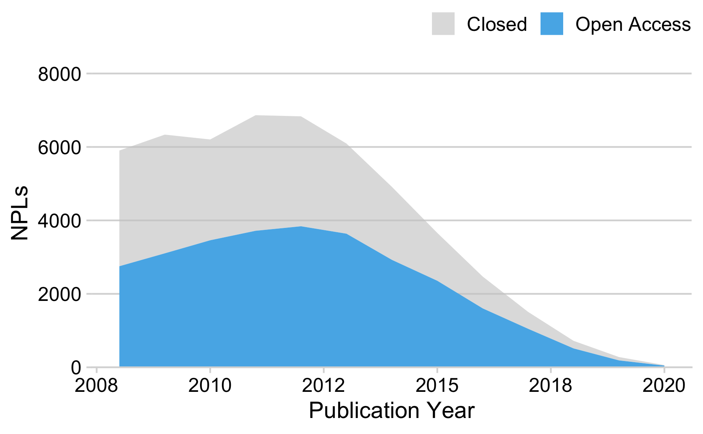
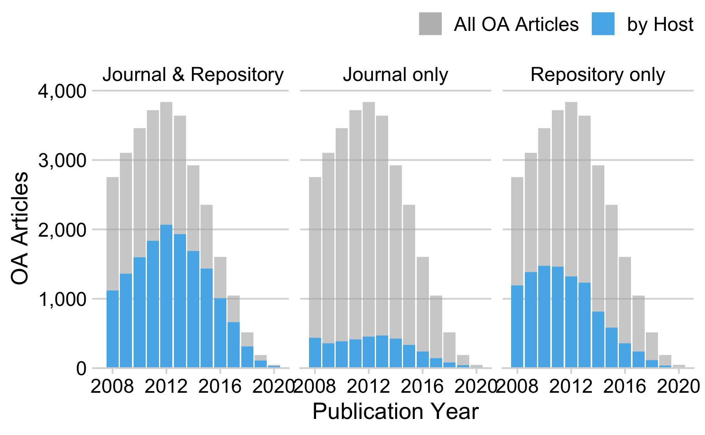
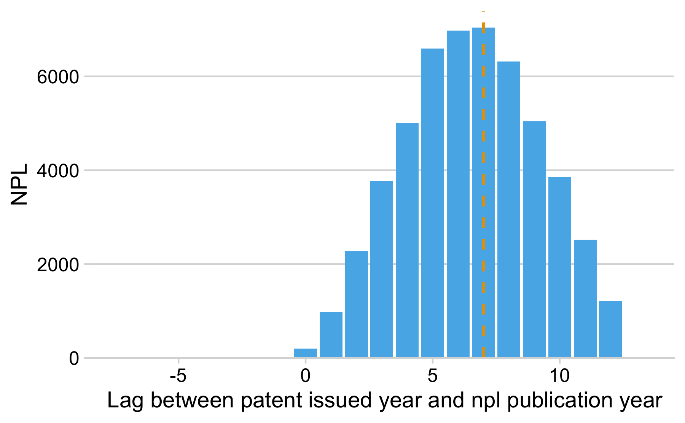
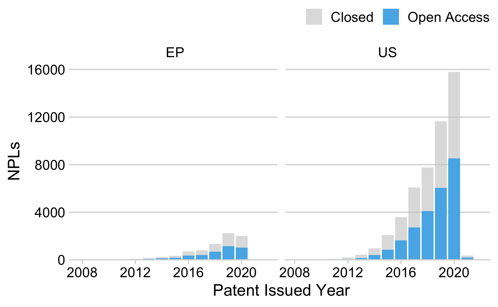

## Data

Patents matched to Unpaywall via DOIs

``` r
npl_df <- readr::read_csv("data/dois_to_be_checked.csv") %>%
  select(doi_cleaned, publication_number, country_code, publication_date) %>%
  mutate(doi = tolower(doi_cleaned))

oa_upy <- jsonlite::stream_in(file("data/oa_patents.json"), verbose = FALSE)
my_df <-
  inner_join(npl_df, oa_upy, by = "doi")
my_df
#> # A tibble: 62,298 x 20
#>    doi_cleaned    publication_num… country_code publication_date doi      genre 
#>    <chr>          <chr>            <chr>                   <dbl> <chr>    <chr> 
#>  1 10.1109/trans… US-10003888-B2   US                   20180619 10.1109… proce…
#>  2 10.1038/nmeth… US-10017760-B2   US                   20180710 10.1038… journ…
#>  3 10.1073/pnas.… US-10017760-B2   US                   20180710 10.1073… journ…
#>  4 10.1093/bioin… US-10017760-B2   US                   20180710 10.1093… journ…
#>  5 10.1371/journ… US-10017760-B2   US                   20180710 10.1371… journ…
#>  6 10.1038/nsmb.… US-10017760-B2   US                   20180710 10.1038… journ…
#>  7 10.1146/annur… US-10017760-B2   US                   20180710 10.1146… journ…
#>  8 10.1016/j.cho… US-10017760-B2   US                   20180710 10.1016… journ…
#>  9 10.1126/scien… US-10017760-B2   US                   20180710 10.1126… journ…
#> 10 10.1126/scien… US-10017760-B2   US                   20180710 10.1126… journ…
#> # … with 62,288 more rows, and 14 more variables: has_repository_copy <lgl>,
#> #   is_paratext <lgl>, is_oa <lgl>, journal_is_in_doaj <lgl>,
#> #   journal_is_oa <lgl>, journal_name <chr>, oa_locations <list>,
#> #   oa_status <chr>, publisher <chr>, published_date <chr>, doi_updated <chr>,
#> #   year <int>, journal_issns <chr>, journal_issn_l <chr>
```

## Exploratory data analysis

### Publication view

#### By publication type

``` r
my_df %>%
  group_by(genre) %>%
  summarise(n = n_distinct(doi)) %>%
  mutate(prop = n / sum(n)) %>%
  arrange(desc(n)) %>%
  knitr::kable()
```

| genre               |     n |   prop |
|:--------------------|------:|-------:|
| journal-article     | 51848 | 0.8323 |
| proceedings-article |  8967 | 0.1439 |
| book-chapter        |  1093 | 0.0175 |
| book                |   139 | 0.0022 |
| posted-content      |   116 | 0.0019 |
| reference-entry     |    64 | 0.0010 |
| report              |    29 | 0.0005 |
| proceedings         |    11 | 0.0002 |
| monograph           |    10 | 0.0002 |
| reference-book      |     8 | 0.0001 |
| journal-issue       |     4 | 0.0001 |
| component           |     2 | 0.0000 |
| dataset             |     2 | 0.0000 |
| other               |     2 | 0.0000 |
| report-series       |     2 | 0.0000 |
| standard            |     1 | 0.0000 |

#### By publication year (journal articles only)

``` r
my_df %>%
  filter(genre == "journal-article") %>%
  group_by(year, is_oa) %>%
  summarise(n = n_distinct(doi)) %>%
  ggplot(aes(year, n, fill = is_oa, group = is_oa)) +
  geom_area() +
   scale_fill_manual(
      values = c("#cccccca0", "#56b4e9"),
      name = NULL,
      labels = c("Closed", "Open Access")
    ) +
  scale_y_continuous(expand = expansion(mult = c(0, 0.05)), limits = c(0, 8000)) +
  cowplot::theme_minimal_hgrid() +
  labs(x = "Publication Year", y = "NPLs") +
  theme(legend.position = "top",
          legend.justification = "right")
```



#### OA by provider

Unpaywall distinguishes the provider of the open access full text,
`publisher` and `repository`.

``` r
oa_df <- my_df %>%
  filter(genre == "journal-article", is_oa == TRUE) %>%
  unnest(oa_locations)

# overlap repo / publisher
host_cat <- oa_df %>%
  distinct(doi, year, host_type, is_best, has_repository_copy) %>%
  filter(is_best == TRUE) %>%
  mutate(provider_cat = case_when(
    host_type == "publisher" & has_repository_copy == TRUE ~ "Journal & Repository",
    host_type == "repository" ~ "Repository only",
    host_type == "publisher" ~ "Journal only"
  )) %>%
  group_by(provider_cat, year) %>%
  summarise(n = n_distinct(doi))

# all years
all_year <- oa_df %>%
  group_by(year) %>%
  summarise(n = n_distinct(doi))

ggplot(host_cat, aes(x = year, y = n)) +
  geom_bar(
    data = all_year,
    aes(fill = "All OA Articles"),
    color = "transparent",
    stat = "identity"
  ) +
  geom_bar(aes(fill = "by Host"), color = "transparent", stat = "identity") +
  facet_wrap( ~ provider_cat, nrow = 1) +
  scale_fill_manual(values = c("#b3b3b3a0", "#56B4E9"), name = "") +
  scale_y_continuous(
      labels = scales::number_format(big.mark = ","),
      expand = expansion(mult = c(0, 0.05))) +
  labs(x = "Publication Year", y = "OA Articles") +
  theme(legend.position = "top", legend.justification = "right") +
  cowplot::theme_minimal_hgrid() +
  theme(legend.position = "top",
           legend.justification = "right")
```



#### OA by Unpaywall OA color

``` r
oa_df %>%
  group_by(oa_status) %>%
  summarise(n = n_distinct((doi))) %>%
  mutate(prop = n / length(unique(oa_df$doi))) %>% 
  arrange(desc(n)) %>%
  knitr::kable()
```

| oa\_status |     n |   prop |
|:-----------|------:|-------:|
| green      | 10224 | 0.3502 |
| gold       |  8441 | 0.2892 |
| bronze     |  7616 | 0.2609 |
| hybrid     |  2910 | 0.0997 |

### Patent view

#### Lag patent and npl publication date

``` r
my_df %>%
  filter(genre == "journal-article") %>%
  select(doi, publication_date, country_code, year) %>%
  mutate(npl_year = substr(publication_date, 1, 4)) %>%
  mutate(lag = as.integer(npl_year) - as.integer(year)) %>%
  ggplot(aes(x = lag)) +
  geom_histogram(stat = "count", fill="#56B4E9") +
  geom_vline(aes(xintercept = median(lag, na.rm = T)),
             colour = "#E69F00", linetype ="dashed", size = .8) +
  cowplot::theme_minimal_hgrid() +
  scale_y_continuous(expand = expand_scale(mult = c(0, 0.05))) +
  labs(y = "NPL", x = " Lag between patent issued year and npl publication year")
```



#### OA by patent office

Only US vs European Patent Office (EP)

``` r
my_df %>%
  mutate(npl_year = substr(publication_date, 1, 4)) %>%
  # only us vs ep
  filter(country_code %in% c("US", "EP")) %>%
  group_by(is_oa, country_code, npl_year) %>%
  summarise(n = n_distinct(doi)) %>%
  ggplot(aes(as.integer(npl_year), n, fill = is_oa)) +
  geom_bar(stat = "identity") +
   scale_fill_manual(
      values = c("#cccccca0", "#56b4e9"),
      name = NULL,
      labels = c("Closed", "Open Access")
    ) +
  scale_x_continuous(limits = c(2008, 2022)) +
  scale_y_continuous(expand = expansion(mult = c(0, 0.05))) +
  facet_wrap(~country_code) +
  cowplot::theme_minimal_hgrid() +
  labs(x = "Patent Issued Year", y = "NPLs") +
  theme(legend.position = "top",
          legend.justification = "right")
```


